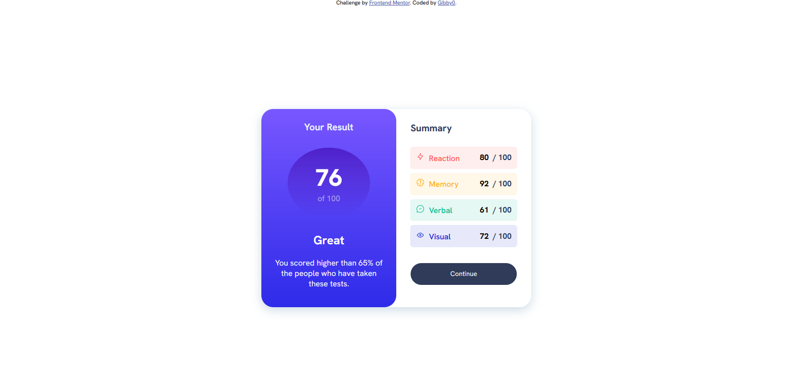

# Frontend Mentor - Results summary component solution

This is a solution to the [Results summary component challenge on Frontend Mentor](https://www.frontendmentor.io/challenges/results-summary-component-CE_K6s0maV). Frontend Mentor challenges help you improve your coding skills by building realistic projects. 

## Table of contents

- [Overview](#overview)
  - [The challenge](#the-challenge)
  - [Screenshot](#screenshot)
  - [Links](#links)
  - [Built with](#built-with)
  - [What I learned](#what-i-learned)
  - [Continued development](#continued-development)
  - [Useful resources](#useful-resources)
  - [Author](#author)

## Overview
This project is a solution to the Result Summary component challenge on Frontend Mentor.

### Screenshot


### Links

- Solution URL: [Add solution URL here](https://your-solution-url.com)
- Live Site URL: [Add live site URL here](https://your-live-site-url.com)


### Built with

- Semantic HTML5 markup
- CSS custom properties
-Flexbox
-Google Fonts - specifically the HankenGrotesk, enhancing the stylistic   delivery of the component.

### What I learned
In this project, I learned how to structure HTML semantically for better accessibility and SEO. Additionally, I enhanced my understanding of CSS by using custom properties, Flexbox for layout, and integrating Google Fonts.

To see how you can add code snippets, see below:

```
```css
body{
    flex-direction: column;
    justify-content: flex-start; 
    align-items: center;
    display: flex;
}
```

### Continued development

I plan to continue focusing on improving my CSS skills, particularly in areas like responsive design and CSS grid layouts.
I plan to continue learning more about Flexbox in order to fully utilize it within my projects. 

### Useful resources

 [Google Fonts - HankenGrotesk]('https://fonts.googleapis.com/css2?family=Hanken+Grotesk:ital,wght@0,100..900;1,100..900&display=swap') - This helped me aquire the font needed for the project.


## Author
- Website - Github(https://github.com/Gibby0)
- Frontend Mentor - [@Gibby0](https://www.frontendmentor.io/profile/Gibby0)
